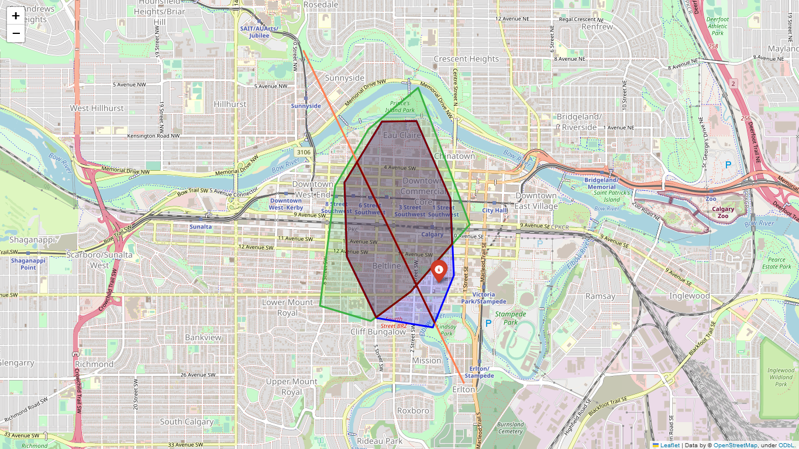

<figure markdown>
{ width="100" }
</figure>

# yyc-community-metrics

An aggregation of community-related data for City of Calgary

## Data Aggregation

Each community is a polygon in the map. When we aggregate data for a community, only the intersected portion of a feature is considered.

See the following examples where we use a blue polygon to represent a community, a green polygon / a orange line / a **point** to represent a feature. Only the red portion of those features will be taken into consideration during data aggregation.

## Projection

Use UTM projection for area / length calculation.

